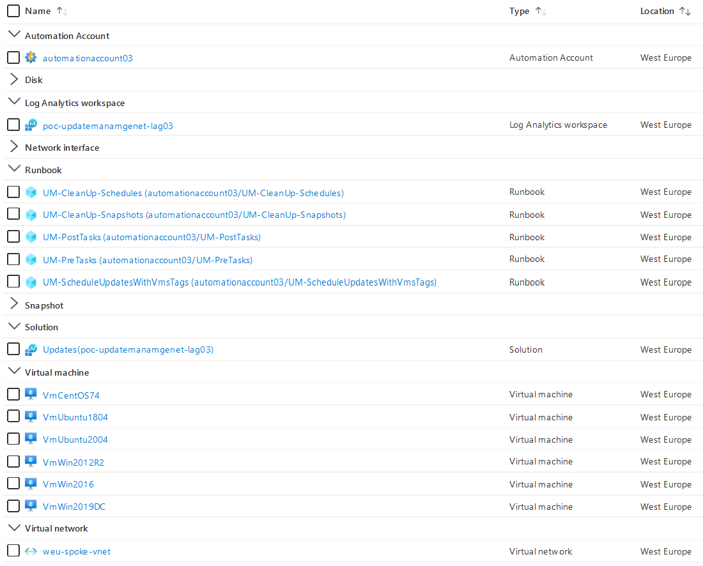
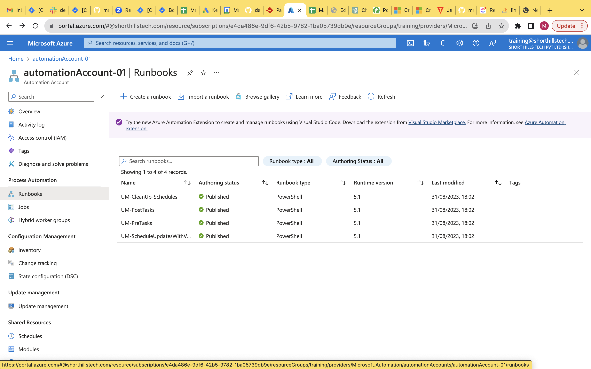

# azure-vm-update-management-with-tags

This repo is a set of Runbooks that allows you to schedule Azure Virtual Machines patching by simply applying the `POLICY_UPDATE` tag on machines.

## Features

Shared Runbooks allows you to:
* Patch **Azure Virtual Machines** with [Supported OS](https://docs.microsoft.com/en-us/azure/automation/update-management/operating-system-requirements#supported-operating-systems)
* Patch in a multi-subscriptions context: the system-assigned managed identity must have **Contributor** role assigned on each subscription.
* Perform several pre and post patching tasks:
  * Pre scripts, before patching:
    * [OPTIONAL] Snapshot VM OS disk 
    * [OPTIONAL] Start VM if it is stopped 
  * Post scripts, after patching:
    * [OPTIONAL] Shutdown VM if it was started by pre-script.
    * [OPTIONAL] Send a patching report email
* Support Azure Arc Server
  * Pre-scripts and post scripts are not supported for Azure Arc Servers
    * You can schedule Azure Arc Servers restarts using `POLICY_RESTART` tag with Runbooks available in [this repo](https://github.com/madgicaltechdom/azure-vm-update-management-with-tags)


## Runbooks description

There is a set of 5 Runbooks that must be deployed in the Automation Account:
* **UM-ScheduleUpdatesWithVmsTags**: Must be scheduled (at least) daily. Searches for all machines with the `POLICY_UPDATE` tag and configures the Update Management schedules.
* **UM-PreTasks**: Triggered before patching, it can perform several optional actions like OS disk snapshot, start VM if stopped, etc..
* **UM-PostTasks**: Triggered after patching, it can perform several optional actions like stop VM if it was started, send patching report mail, etc..
* **UM-CleanUp-Snapshots**: Must be scheduled daily, to delete snapshots that are X days older.
* **UM-CleanUp-Schedules**: Must be schedule (at least) daily. It removes Update Management schedules for VM machines that not longer have the `POLICY_UPDATE` tag

## Prerequisites
  - Create an Azure account
  - install Azure cli
  - install bicep

Automation Account must have the following modules installed:
* Az.ResourceGraph, >= 0.11.0
* Az.ConnectedMachine >= 0.2.0
* Az.Automation >= 1.7.1
* Az.Compute >= 4.17.1

**Note**: Runbooks must be deployed using Powershell Runtime v5.1 

# Getting started

## Quick deployment (for testing purpose)

To quickly test provided Runbooks, use the provided bicep script to deploy a complete testing infrastructure that will: 
* Deploy a Log Analytics Workspace
* Deploy an Automation Account using a System-assigned Magaged Identity
  * Install Update Management solution
  * Assign *Contributor* role on the System-assigned Managed Identity to the Resource Group
* Deploy 5 Runbooks to the Automation Accounts and schedule few of them
* Deploy 1 VNet
* Deploy 6 VMs (3 Windows, 3 Linux) in the VNet
  * with Log Analytics agent installed and plugged to the Log Analytics Workspace
  * with `POLICY_UPDATE` tag examples
* If you want to receive a **mail report**, 2 variables in the Automation Account needs to be defined : 
  * SendGridAPIKey (type: secure string): API access key provided by SendGrid to use your account
  * SendGridSender (type: string): Sender email address (from) configured on SendGrid

Here is a *partial* screenshot of deployed resources:
 

**Quick start:**

Step-by-step user guide [Part 1](https://us05web.zoom.us/clips/share/BHVzMDQgG5b4qm6TZeEBrohDKyWQ9tNNJRBSiuXw38Ofe4BQF7k)
[Part 2](https://us05web.zoom.us/clips/share/BHVzMDQgoiTes0AggeOFVSbwUJjT6iX8KAp89ra77BqWaquBjN0)

```bash

# Clone the repo with following command

$ git clone https://github.com/madgicaltechdom/azure-update-management-with-tags.git

...
#Then run bicep file to deploye

$ cd azure-update-management-with-tags/bicep
```

* Deploy **without email feature**:
```bash
$ az deployment group create --resource-group your-resource-group-name --template-file main.bicep
```

Infrastructure deployment will take around 5 minutes and it can take until 20 minutes to have update agent ready and first patching assessment. 


# Output images

